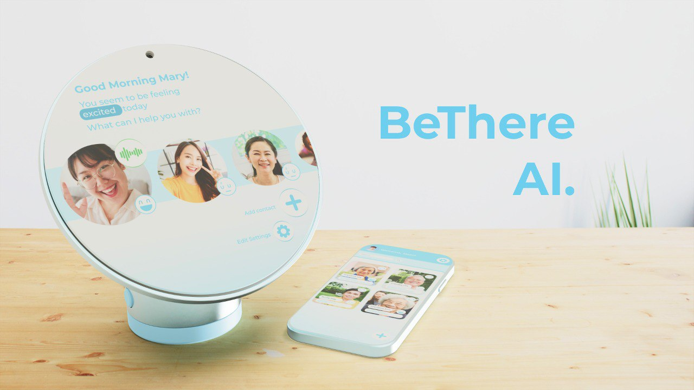

<h2 align="center"><b>BeThereAI</b></h2>

<h4 align="center">
  <b>Stay Close no matters the miles</b>
  <br /><br />
  <a href="https://uc-berkeley-ai-hackathon.devpost.com">UC Berkeley AI Hackathon 2023</a>
</h4>

<p align="center">
<a href="https://github.com/xJQx/BeThereAI/blob/master/LICENSE" target="blank">

</a>
<a href="https://github.com/xJQx/BeThereAI/fork" target="blank">

</a>
<a href="https://github.com/xJQx/BeThereAI/stargazers" target="blank">

</a>
<a href="https://github.com/xJQx/BeThereAI/issues" target="blank">

</a>
<a href="https://github.com/xJQx/BeThereAI/pulls" target="blank">

</a>
</p>

<p align="center">
    <a href="https://github.com/xJQx/BeThereAI/issues/new/choose">Report Bug</a>
    ·
    <a href="https://github.com/xJQx/BeThereAI/issues/new/choose">Request Feature</a>
</p>

## 👋🏻 Introducing `BeThereAI`

<p align="center">
  
</p>

Revolutionizing Emotional Connections Across Generations. Our AI-powered device and application seamlessly bridges the communication gap between working adults and their elderly loved ones, enhancing physical and emotional connections.

<br />

## 🎯 Product Goals

1. Stengthen **emotional connections** by creating personalized video messages to replicate human-to-human conversations

2. Increase **accessibility** and **independence** for elderly people living alone by giving them a simpler and more intuitive technology

3. Provide **emotional relieve** for working adults as they have an easier way to check in on their elderly loved ones

<br />

## 🔥 Product Features

#### 1. Phone App for the Working Adult

- Receive mood notifications from the elderly
- Translate audio messages to text for easy access
- Automatically attach emoticons when texting
- Send texts to respond, and `BeThereAI` will translate it to a personal deepfake video for their elderly language translation

#### 2. Tabletop Assistant for the Elderly Person

- Receive deepfake videos created from working adult’s messages
- Receive activity suggestions based on facial mood recognition
- Send messages through voice and video language translation

<br />

## 💪🏻 Try Yourself

1. Get a copy of this repository by opening up your terminal and run:

```bash
git clone https://github.com/xJQx/BeThereAI.git
```

2. Setup frontend application

Install Dependencies:

```bash
cd frontend
yarn add
```

Start up the frontend application:

```bash
yarn start
```

Open http://localhost:3000/ in your browser. Note: view the app in **`mobile view`** for the real experience.

3. Setup backend application

Create Virtual Environment:

```bash
cd backend
python -m venv .venv
. .venv/bin/activate
```

Install Dependencies:

```bash
pip install -r requirements.txt
```

Setup API Keys by creating a `.env` file with the following secrets (refer to `.env.example`):

```bash
OPENAI_API_KEY=
HUME_API_KEY=
```

Start up the backend application:

```bash
uvicorn main:app --reload
```

<br />

Congratulations, you have successfully created your own copy of BeThereAI.

<br />

## 🏗️ Tech Stack


<br />

## ✨ Contributors

<a href='https://github.com/xJQx' title='Jing Qiang'> </a>
<a href='https://github.com/ztjhz' title='Jing Hua'> </a>
<a href='https://github.com/pinguin247' title='Yi Ping'> </a>
<a href='https://www.linkedin.com/in/catherine-liu-75a7471b2' title='Catherine'> </a>

<br />

## 💡 Contributing

Have an idea or improvement to make? Create an issue and make a pull request!

Liked it? Please give a ⭐️ to **BeThereAI**.
